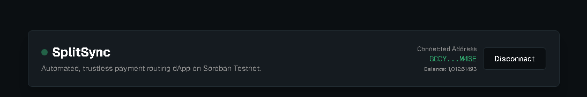
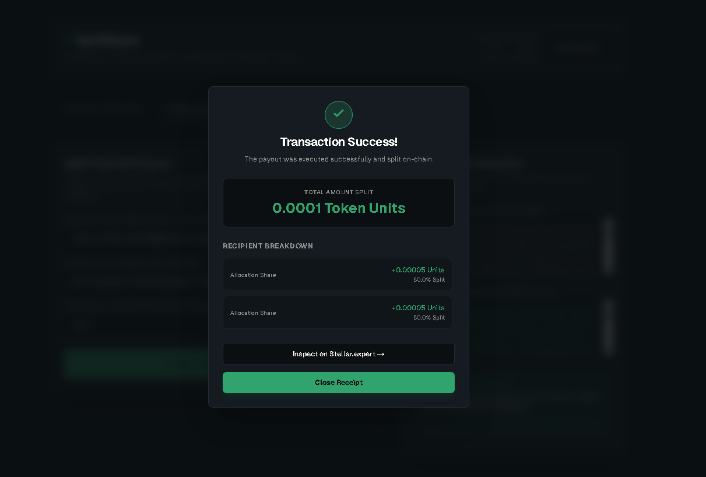
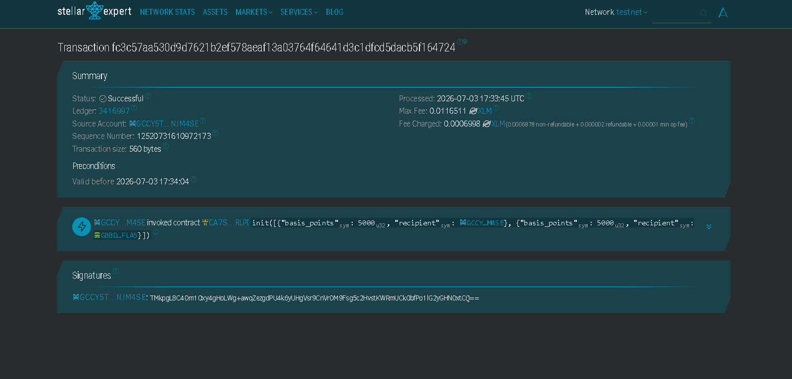

# SplitSync


---

🚀 **Status**: This project is currently **ongoing** and actively developed for the **Stellar Challenge**!

---

## 1. Project Description

When independent freelancers form a temporary collective for a single gig, dividing the client's payment is an administrative and trust bottleneck. Usually, one member must receive the lump sum in their personal bank account, exposing them to unfair tax liabilities and introducing counterparty risk for the rest of the team.

**SplitSync** solves this by offering decentralized "accounting as a service". Collectives deploy a temporary, immutable smart contract defining each member's split allocation. When the client pays the contract, funds are instantly and automatically routed as fractional USDC payments directly to each member's wallet, with zero intermediary risk and zero locked dust.

---

## 2. Technology Stack

- **Smart Contract Backend**: Soroban Smart Contracts (Rust, `no_std`)
- **Frontend UI**: Next.js 16 (App Router) + TypeScript + Tailwind CSS v4
- **Wallet Integration**: `@creit.tech/stellar-wallets-kit` (Freighter, Albedo, xBull)
- **Stellar Connection**: `@stellar/stellar-sdk` (Transaction builder, ScVal XDR serialization, simulation, and RPC communication)
- **RPC Gateway**: Stellar Testnet RPC (`https://soroban-testnet.stellar.org`)

---

## 3. How It Works

1. **Initialization (`init`)**: 
   The contract is initialized with a vector of `Share` structs containing recipient addresses and their basis point allocations. 
   * **Security Rule**: The contract utilizes a double-initialization check to prevent any overwrite hijacking. 
   * **Allocation Rule**: The sum of all basis points must equal exactly `10,000` (100%).
2. **Distribution (`pay`)**: 
   Pulls stablecoin tokens (e.g. USDC) from the sender into the contract, computes each recipient's share, and transfers it out. 
   * **Dust Prevention**: To prevent integer division truncation leaving residual tokens locked inside the contract, any remainder ("dust") is automatically routed to the final recipient in the shares list. The contract balance always returns to `0`.

---

## 4. How to Use & Simulation Addresses

1. **Connect Wallet**: Click **Connect Wallet** in the top right to open the Stellar Wallets Kit modal. Select your preferred wallet (Freighter, Albedo, or xBull) on the Stellar Testnet.
2. **Configure Splits**:
   * On the **Configure Split** tab, enter the recipient addresses and their percentage shares (in basis points, e.g. 50% = 5000).
   * Ensure the total adds up to exactly `10,000`.
   * Click **Initialize Split Contract** and approve the transaction in your wallet.
3. **Execute Split Payment**:
   * On the **Execute Split Payment** tab, input the Token contract address, the paying sender's address, and the payment amount.
   * **Simulation Addresses for Testing**:
     * **Mock USDC (Stellar Asset Contract / SAC)**: 
       `CBIELTK6YBZJU5UP2WWQEUCYKLPU6AUNZ2BQ4WWFEIE3USCIHMXQDAMA`  
       *(Note: Requires establishing a USDC trustline in your wallet first)*
     * **Wrapped Native XLM Token Contract**: 
       `CDLZFC3SYJYDATH7KMIN747M3AT573QD47G3P6SI27BJM27BJM27BJM2`  
       *(Recommended for instant testing: no trustline required!)*
   * Click **Trigger Split Payment** and sign the transaction to distribute the funds instantly.

---

## 5. Visual Dashboard Screenshots

### A. Wallet Connection & Dashboard State


### B. Wallet Balance Displayed (USDC/XLM)


### C. Transaction Success Modal Breakdown


### D. Successful Testnet Transaction


---

## 6. Setup & Getting Started (How to Run Locally)

### Prerequisites
- **Rust Toolchain**: `rustc 1.74.0+` with `wasm32-unknown-unknown` target
- **Soroban/Stellar CLI**: `stellar-cli 20.0.0+`
- **Node.js**: `v18.0.0+` & `npm`

---

### Step A: Smart Contract Backend

1. Navigate to the contract folder:
   ```bash
   cd split_sync
   ```
2. Build the contract into WASM bytecode:
   ```bash
   stellar contract build
   ```
3. Run the unit test suite:
   ```bash
   cargo test
   ```

---

### Step B: Next.js Frontend

1. Navigate to the frontend directory:
   ```bash
   cd ../frontend
   ```
2. Install the dependencies (uses `--ignore-scripts` to prevent Windows postinstall command shell issues):
   ```bash
   npm install --ignore-scripts
   ```
3. Start the local development server:
   ```bash
   npm run dev
   ```
4. Open [http://localhost:3000](http://localhost:3000) in your browser.

---

## 7. Roadmap

We are continuously developing and expanding the SplitSync ecosystem. Here is what is planned next:

- [ ] **Better UI**: Polish styling, custom widgets, and support responsive layouts across mobile.
- [ ] **Landing Page**: Build a beautiful SaaS homepage explaining SplitSync features, gas costs, and trust benefits.
- [ ] **Dynamic Share Renegotiation**: Allow members to collectively sign a multi-signature transaction to modify splits on an existing contract without redeploying.
- [ ] **Automated Tax Ledger & Invoice Reporting**: Generate downloadable tax forms/invoices based on actual split payouts directly fetched from the Stellar ledger.
- [ ] **Fiat Off-Ramping Integration**: Enable one-click conversion of USDC payouts directly to local fiat bank accounts via Stellar anchor integrations (such as MoneyGram).
- [ ] **Contract Factory & Templates**: Deploy a master "Contract Factory" allowing anyone to deploy their own payment splitter instantly with customizable templates for different freelance teams.
