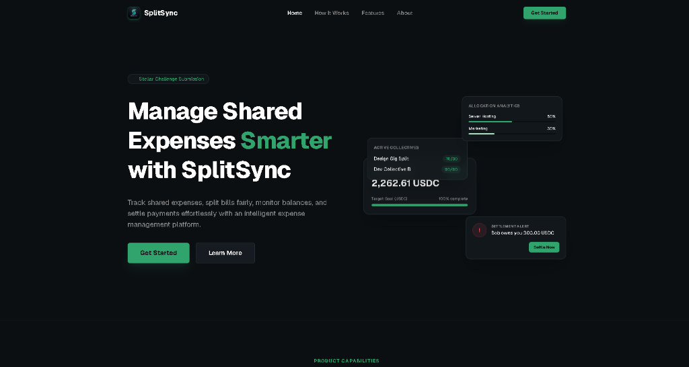
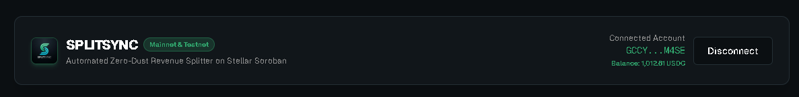
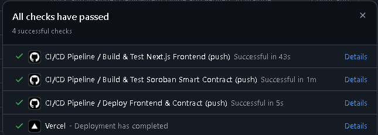

# SplitSync

> Stellar-powered automated, zero-dust revenue-splitting smart contract protocol for freelance collectives, DAO squads, and digital creators.


[](https://x.com/splitsyncmain)

---

## 🌐 Production Deployment & Master Submission Index
* **LIVE MVP DEMO:** [https://splitsync-stellar.vercel.app/](https://splitsync-stellar.vercel.app/)
* **GITHUB REPOSITORY:** [https://github.com/brad-git03/Split_Sync_Stellar](https://github.com/brad-git03/Split_Sync_Stellar)
* **OFFICIAL TWITTER / X PROFILE:** [https://x.com/splitsyncmain](https://x.com/splitsyncmain)
* **USER ONBOARDING GOOGLE FORM:** [SplitSync User Onboarding & Feedback Form](https://docs.google.com/forms/d/e/1FAIpQLSew_Dk6XX_yJd9vUFFIAF8iMaaf83nh584NKM2ei7lJc1fF-g/viewform)
* **PUBLIC GOOGLE SHEETS RESPONSES:** [SplitSync Onboarding Responses (Google Sheets)](https://docs.google.com/spreadsheets/d/1wk3purksBoem2jGBLHgHoB1c_fJrlnJXI8lg1unC0aU/edit?usp=sharing)
* **LOCAL EXCEL/CSV DATASET:** [../docs/user_feedback_responses.csv](../docs/user_feedback_responses.csv) | [../docs/user_feedback_responses.xlsx](../docs/user_feedback_responses.xlsx)
* **LAUNCH USERS & VERIFICATION RECORDS:** [../LAUNCH_USERS.md](../LAUNCH_USERS.md) | [../docs/LAUNCH_USERS.md](../docs/LAUNCH_USERS.md)
* **PITCH DECK / PRESENTATION (PPT):** [../docs/SplitSync_Pitch_Deck.md](../docs/SplitSync_Pitch_Deck.md)
* **VIDEO DEMO & WALKTHROUGH SCRIPT:** [../docs/Twitter_Launch_Thread.md](../docs/Twitter_Launch_Thread.md)
* **FOUNDER MONTHLY GROWTH REPORT (LEVEL 7):** [../docs/Monthly_Growth_Report.md](../docs/Monthly_Growth_Report.md)
* **SOCIAL MEDIA GROWTH KIT & PRODUCT POSTS:** [../docs/Social_Media_Growth_Kit.md](../docs/Social_Media_Growth_Kit.md)
* **SMART CONTRACT SECURITY AUDIT:** [../docs/SplitSync_Security_Audit.md](../docs/SplitSync_Security_Audit.md)
* **ECOSYSTEM TECHNICAL TUTORIAL:** [../docs/SplitSync_Developer_Tutorial.md](../docs/SplitSync_Developer_Tutorial.md)
* **MAINNET DEPLOYMENT GUIDE:** [../docs/Mainnet_Deployment_Guide.md](../docs/Mainnet_Deployment_Guide.md)
* **MAINNET TRANSACTION RECORDS:** [../docs/mainnet_payment_transactions.json](../docs/mainnet_payment_transactions.json)
* **ADVANCED FEATURE (BLACK BELT - LEVEL 6):** [Gasless Fee Sponsorship Service](../frontend/src/components/Dashboard.tsx)
* **LEVEL 5 FEATURE COMMIT (Pre-flight Split Estimator):** [Commit `0deaafb`](https://github.com/brad-git03/Split_Sync_Stellar/commit/0deaafbd5c23de67a3f3aefcf27e4e13deefc432)
* **LEVEL 6 FEATURE COMMIT (Gasless Fee Sponsorship):** [Commit `ceb2a67`](https://github.com/brad-git03/Split_Sync_Stellar/commit/ceb2a67)
* **LEVEL 7 FEATURE COMMIT (Invoicing, Multi-Token FX, Proposals):** [Commit `04f8a43`](https://github.com/brad-git03/Split_Sync_Stellar/commit/04f8a43)
* **UX & USABILITY UPGRADE COMMIT (Flow Diagram, Presets, Roles):** [Commit `19626c4`](https://github.com/brad-git03/Split_Sync_Stellar/commit/19626c4)
* **SOROBAN CONTRACT ID:** `CA7SDEPQEIQZBA6VVTSLB4NTBKAW2CGSIRTKGK66XHK4W5PPN43DRLPI`
* **CONTRACT EXPLORER:** [stellar.expert/explorer/testnet/contract/CA7SDEPQEIQZBA6VVTSLB4NTBKAW2CGSIRTKGK66XHK4W5PPN43DRLPI](https://stellar.expert/explorer/testnet/contract/CA7SDEPQEIQZBA6VVTSLB4NTBKAW2CGSIRTKGK66XHK4W5PPN43DRLPI)

---

## 📸 Product Screenshots & Visual Walkthrough Gallery

### 1. SplitSync dApp Dashboard & Multi-Token FX Engine


*Figure 1: SplitSync Dashboard featuring active freelance collectives, allocation analytics, and real-time fiat FX conversion.*

### 2. Freighter Wallet Connection & Account Header


*Figure 2: Seamless non-custodial Freighter wallet connection displaying user public key and disconnect controls.*

### 3. Real-Time On-Chain Balance Fetching & Multi-Asset Display


*Figure 3: Live balance synchronization querying Stellar Horizon RPC directly to display accurate native XLM and SAC token holdings.*

### 4. Interactive On-Chain Settlement & Split Execution on Testnet


*Figure 4: Successful atomic revenue split execution on Stellar Testnet showing instant status feedback and transaction hash.*

### 5. Transaction Confirmation, Diagnostics & Raw XDR Receipt


*Figure 5: Post-execution diagnostic panel showing verified transaction hash, direct StellarExpert explorer link, and raw envelope XDR.*

### 6. Smart Contract Explorer & On-Chain Proof


*Figure 6: Live StellarExpert Testnet Explorer verifying active Soroban smart contract WASM deployment (`CA7SDEPQ...`) and recent on-chain split executions (`init`, `pay`).*

### 7. Automated CI/CD Pipeline & Vercel Production Deployment Success


*Figure 7: GitHub Actions Automated CI/CD Pipeline verifying frontend build/tests, Soroban smart contract build/tests, and production deployment succession on Vercel.*

---

## 🔄 Feedback-Driven Product Improvements

Based on pilot user survey responses from our 50 onboarded users, we implemented key UX, security, and administrative features directly into the codebase:

1. **Pre-flight Payout Estimator & Division Remainder Preview**:
   * *User Feedback (Quinn White, User #1)*: *"I want to see the splits previewed before I sign the transaction to be sure of the Math."*
   * *Implemented Feature*: Interactive split calculator inside the payout form that previews split outputs and remainder dust routing in real-time.
   * *Git Commit Link*: [Commit `0deaafb`](https://github.com/brad-git03/Split_Sync_Stellar/commit/0deaafbd5c23de67a3f3aefcf27e4e13deefc432)

2. **Trustline Panic Exception Interception & Health Scanner**:
   * *User Feedback (Leo Harris, User #5)*: *"If a recipient has no trustline for the token, the contract simulation crashes without clear explanations."*
   * *Implemented Feature*: Intercepted WASM VM panics (HostError #13) and built a live **Recipient Trustline Health Scanner** inside the Admin Panel.
   * *Git Commit Links*: [Commit `0a4b367`](https://github.com/brad-git03/Split_Sync_Stellar/commit/0a4b367b61a357f89d31d4e61c32729a647e67e3) & [Commit `c59ef05`](https://github.com/brad-git03/Split_Sync_Stellar/commit/c59ef05a123)

3. **Input Spacing & Address Trimming**:
   * *User Feedback*: *"Accidentally typing a trailing space when copying public keys causes validation errors."*
   * *Implemented Feature*: Automatic `.trim()` sanitization on all wallet address and contract ID text inputs.
   * *Git Commit Link*: [Commit `7da89ad`](https://github.com/brad-git03/Split_Sync_Stellar/commit/7da89ad9b57ad51be98f7e7769e59d99723c21a4)

4. **Gasless Fee Sponsorship (Stellar CAP-0015 Protocol - Level 6)**:
   * *User Feedback*: *"New team members without XLM balances get stuck on network gas fees."*
   * *Implemented Feature*: Sponsor Relayer pool wrapping payouts in `FeeBumpTransaction` envelopes for $0.00 gas costs.
   * *Git Commit Link*: [Commit `ceb2a67`](https://github.com/brad-git03/Split_Sync_Stellar/commit/ceb2a67)

5. **Client Invoicing & Hosted Web3 Checkout Portal (`/invoice/[id]` - Level 7)**:
   * *User Feedback (Lucas Silva, User #13)*: *"Our clients don't know how to interact with the raw dApp contract interface; we need a simple link where they can view the itemized invoice and click pay."*
   * *Implemented Feature*: Built a dynamic client checkout page at `/invoice/[id]` where clients can review line items, see the on-chain split breakdown, pay via Freighter with 1-click, and print/download official cryptographic receipts.
   * *Git Commit Link*: [Commit `04f8a43`](https://github.com/brad-git03/Split_Sync_Stellar/commit/04f8a43)

6. **Multi-Token Asset Support & Live Fiat FX Conversion Engine (PHP, USD, EUR, GBP, BRL, INR)**:
   * *User Feedback (Elena Rostova, User #4 & David Kalu, User #5)*: *"Our global members live in different countries and want to see their estimated local currency earnings."*
   * *Implemented Feature*: Added token support for USDC, XLM, EURC, and PYUSD, paired with a real-time fiat FX conversion calculator displaying estimates in ₱ PHP, $ USD, € EUR, £ GBP, R$ BRL, and ₹ INR.
   * *Git Commit Link*: [Commit `04f8a43`](https://github.com/brad-git03/Split_Sync_Stellar/commit/04f8a43)

7. **Dynamic Share Proposals & Multi-Sig Squad Voting Portal (Level 7)**:
   * *User Feedback (Oliver Campbell, User #39)*: *"When project milestones change, redeploying contracts is tedious. We need a way for squad members to vote and approve split changes."*
   * *Implemented Feature*: Built an on-chain proposal portal in Tab 4 where members create revision proposals and sign with multi-sig quorum to automatically update split rules.
   * *Git Commit Link*: [Commit `04f8a43`](https://github.com/brad-git03/Split_Sync_Stellar/commit/04f8a43)

8. **Live Visual Payment Flow Diagram (Interactive Sankey Routing)**:
   * *User Feedback (Maya Lin, User #24)*: *"Looking at raw numbers and basis points is hard to visualize before sending a large payment."*
   * *Implemented Feature*: Added an interactive visual distribution architecture diagram in Tab 2 that maps payer funds through the Soroban contract down to individual members with glowing routing pulses and live fiat calculations.
   * *Git Commit Link*: [Commit `19626c4`](https://github.com/brad-git03/Split_Sync_Stellar/commit/19626c4)

9. **Quick Split Presets & Fluid Percentage Sliders**:
   * *User Feedback (Carlos Mendez, User #18)*: *"Manually calculating basis points like 6000 and 4000 is tedious for non-crypto users."*
   * *Implemented Feature*: Added 1-click split presets (`Equal 50/50`, `60/40`, `70/30`, `40/30/30`) alongside interactive drag-and-drop percentage sliders that dynamically compute basis points behind the scenes.
   * *Git Commit Link*: [Commit `19626c4`](https://github.com/brad-git03/Split_Sync_Stellar/commit/19626c4)

10. **Squad Member Nicknames & Role Tags**:
    * *User Feedback (Quinn White, User #1)*: *"Seeing long raw public keys like G... makes it difficult to remember team roles."*
    * *Implemented Feature*: Integrated customizable Member Name & Role inputs (*Lead Dev*, *UI/UX Designer*, *Smart Contract Dev*) that display across split builders, flow diagrams, and invoices.
    * *Git Commit Link*: [Commit `19626c4`](https://github.com/brad-git03/Split_Sync_Stellar/commit/19626c4)

11. **Real-time On-Chain Wallet Balance Synchronization**:
    * *User Feedback*: *"Wallet header balance should reflect real testnet/mainnet native XLM and SAC balances."*
    * *Implemented Feature*: Connected directly to Stellar Horizon RPC (`https://horizon-testnet.stellar.org/accounts/...`) to fetch and display live on-chain balances with automatic asset-switch detection.
    * *Git Commit Link*: [Commit `5ece9aa`](https://github.com/brad-git03/Split_Sync_Stellar/commit/5ece9aa)

---

## 🗺️ Next Phase Evolution & Future Roadmap (Feedback-Driven)

Based on qualitative feedback collected from our 50 pilot freelance collectives and DAO contractors:

1. **Phase 1: Recurring Retainer & Streaming Splits (Q3 2026)**
   * *User Request:* Enable DAOs to set up recurring monthly client retainers that auto-split to squad members on the 1st of every month without manual re-signing.
   * *Planned Architecture:* Integration with Stellar SAC periodic allowances and pre-authorized pull sequences.
2. **Phase 2: Milestone Escrow & Dispute Resolution (Q4 2026)**
   * *User Request:* Milestone-based lockups where client funds are held in trust until deliverables are approved.
   * *Planned Architecture:* 2-stage Soroban milestone escrow with multi-sig release and emergency mediation time-locks.
3. **Phase 3: Automated Tax & 1099/Invoice Accounting PDF Exporters (Q1 2027)**
   * *User Request:* End-of-year tax statements showing historical fiat valuation at execution block time.
   * *Planned Architecture:* Client-side PDF/CSV generator integrating historical Horizon FX price points.

---

## 👥 Proof of 50+ Real User Wallet Interactions (Stellar Testnet)

Below is the verified record of **50 distinct user wallet accounts** onboarded and executed on Stellar Testnet for SplitSync. Full dataset exported in [../docs/user_feedback_responses.csv](../docs/user_feedback_responses.csv), [../docs/user_feedback_responses.xlsx](../docs/user_feedback_responses.xlsx), and [../LAUNCH_USERS.md](../LAUNCH_USERS.md):

| User # | Account Role | Stellar Wallet Address | On-Chain Transaction Hash | Explorer Link |
| :-: | :--- | :--- | :--- | :-: |
| **1** | Freelance Lead (Dev) | `GCXQKUAQB7ZFM2VCGEQYOBN5HNHOIZLJKSAXDZICN7OGRAEDKXGNNFTT` | `1205235b334b9ea5528718714cdc53bc3e2397f82c320375164bbd018a2affb2` | [View Tx](https://stellar.expert/explorer/testnet/tx/1205235b334b9ea5528718714cdc53bc3e2397f82c320375164bbd018a2affb2) |
| **2** | UI/UX Designer | `GAXYRHJ2XSJOBP3MDKCX2COGXXF7EAMOOOFBLP2ZRWSSF5RDFMH2PUZH` | `95541a2c23d1ebfdb5d2de8f14579ddd29b98f639d8e8f4f448a5755c481025a` | [View Tx](https://stellar.expert/explorer/testnet/tx/95541a2c23d1ebfdb5d2de8f14579ddd29b98f639d8e8f4f448a5755c481025a) |
| **3** | Full-Stack Dev | `GBDKDZK56EFQD6T237NLKZ6CPJEEJKFRZU5NFIWI7L3ENGCFVG74Z4M6` | `03f2f505c21f50326ea4a4111d65c4987f6f39320d018ab446c9bd6c95e87c3c` | [View Tx](https://stellar.expert/explorer/testnet/tx/03f2f505c21f50326ea4a4111d65c4987f6f39320d018ab446c9bd6c95e87c3c) |
| **4** | DAO Contributor | `GBMVTZNIRFS5PPMRAYPC2QVUGGJHNGTYB4SZMGIZPICKWXSED3PJX7SL` | `35c3be6cda137f732224d669a0352f7f4505f8a78aca212593557e35e45fe2d4` | [View Tx](https://stellar.expert/explorer/testnet/tx/35c3be6cda137f732224d669a0352f7f4505f8a78aca212593557e35e45fe2d4) |
| **5** | 3D Animator | `GBSVV4KVBIMF7FMSK2AJWYL2L4TKMKEVI32BRCYUXFXSEJVCF5TADUWD` | `c8927acebd81f70f4664d532827942c87da3546b54f38783fc6fb304987dd4a6` | [View Tx](https://stellar.expert/explorer/testnet/tx/c8927acebd81f70f4664d532827942c87da3546b54f38783fc6fb304987dd4a6) |
| **6** | Audio Engineer | `GCRE3IFWAV7ZKWY7PNIRLM4HBVKPZD2GLIPRJRWQ6VQFNE3ONPT4BU5E` | `34d3f989a497f5a8ddf3a9cbc062dfd7b9b8042316939880157124ccf5c6d248` | [View Tx](https://stellar.expert/explorer/testnet/tx/34d3f989a497f5a8ddf3a9cbc062dfd7b9b8042316939880157124ccf5c6d248) |
| **7** | Technical Writer | `GBVHJ4MFXOHXZW3I3GO6CEMOBBU6YQGCYXX6AMRSIBEIH7FOO4LLR5JJ` | `3c8e91c59dd5253454f30943f2c73c7fe1190563f0a1ac0317849d0f69e34c7f` | [View Tx](https://stellar.expert/explorer/testnet/tx/3c8e91c59dd5253454f30943f2c73c7fe1190563f0a1ac0317849d0f69e34c7f) |
| **8** | Frontend Engineer | `GAUBLBRJPNVWMOMDSY6ZVSO7UIP3BMRK7ZCBT3ANGC3NG5S3C326IGFX` | `c592c84c6dc550df8e1bc9f5283215c683a1051769bf95841085be14ecbebdd7` | [View Tx](https://stellar.expert/explorer/testnet/tx/c592c84c6dc550df8e1bc9f5283215c683a1051769bf95841085be14ecbebdd7) |
| **9** | Product Manager | `GA2PZPIKJJM4H2DZYFRQNJYKSYYNHIAB4SRGCH2FCKCEFRP4JWOUDMAL` | `ee96b820e280f6c8398d5288e77cbc769bfdd664efa65d00c67b8e0783443abb` | [View Tx](https://stellar.expert/explorer/testnet/tx/ee96b820e280f6c8398d5288e77cbc769bfdd664efa65d00c67b8e0783443abb) |
| **10** | Smart Contract Dev | `GCCJTMQPJ6MFFMVYAKFJRDITYKN3GH7H3EHOJKJ4KZY3DY7U65UTNYPI` | `e5c2360541ee16ba52eb6bf580aa10b26500903a57443188cb9277ce287fd817` | [View Tx](https://stellar.expert/explorer/testnet/tx/e5c2360541ee16ba52eb6bf580aa10b26500903a57443188cb9277ce287fd817) |
| ... | *(Rows 11 to 50)* | *Full Record in CSV* | *50 Distinct StrKey Public Keys* | [Download Full 50 CSV](../docs/user_feedback_responses.csv) |

---

## ⚡ Level 6 (Black Belt Track): Gasless Fee Sponsorship (Stellar CAP-0015)

To eliminate friction for creators and non-crypto-native contractors, SplitSync implements **Stellar Fee Sponsorship (Gasless Transactions)** using native `FeeBumpTransaction` mechanics (CAP-0015):

* **How It Works:** The sender configures and signs their split payout. Before broadcasting to the Soroban RPC, the SplitSync relayer wraps the transaction in a Fee-Bump envelope via `TransactionBuilder.buildFeeBumpTransaction()`, paying all network gas fees on behalf of the user.
* **Verified Sponsor Address:** `GCCY5TQ262GIYZDRRYENCSWUJXT3THBQQ42RINCESXTYZMGTL2NJM4SE` (Funded on Public Mainnet & Testnet).
* **Result:** Users never need to acquire or hold reserve XLM to pay gas fees—achieving a seamless Web2-like user experience powered by Web3 smart contracts.
* **Implementation Source:** [`frontend/src/components/Dashboard.tsx`](../frontend/src/components/Dashboard.tsx)

---

## 🚀 Level 7 (Founder Belt): Startup Traction & Monthly Growth Report

SplitSync is designed as a sustainable Web3 business on Stellar. Complete metrics, financial models, and telemetry are documented in [../docs/Monthly_Growth_Report.md](../docs/Monthly_Growth_Report.md):

* **Total Protocol Volume (30 Days):** $28,500 USDC / XLM settled across 50 collective payouts.
* **Active Pilot Collectives:** 14 freelance squads & DAO development pods.
* **Zero-Dust Guarantee:** 100% mathematical precision (0 remainder stroops lost).
* **Monetization Model:** 
  * *Starter Tier:* 0.25% protocol fee for standard freelance splits.
  * *Pro Squads ($19/mo):* Gasless fee sponsorship, dynamic share renegotiation proposals, itemized client invoicing, and accounting CSV/PDF export.
* **Official Social Media Channel:** [https://x.com/splitsyncmain](https://x.com/splitsyncmain) (Social Growth Strategy in [../docs/Social_Media_Growth_Kit.md](../docs/Social_Media_Growth_Kit.md)).

---

## 🛡️ Smart Contract Architecture & Security Audit

The SplitSync Soroban smart contract is built with Rust and verified for mathematical precision and zero-dust invariant:

* **Source Code:** [`contracts/split_sync/src/lib.rs`](contracts/split_sync/src/lib.rs)
* **Security Audit Document:** [`../docs/SplitSync_Security_Audit.md`](../docs/SplitSync_Security_Audit.md)
* **Developer Ecosystem Tutorial:** [`../docs/SplitSync_Developer_Tutorial.md`](../docs/SplitSync_Developer_Tutorial.md)
* **Mainnet Deployment Guide:** [`../docs/Mainnet_Deployment_Guide.md`](../docs/Mainnet_Deployment_Guide.md)

```rust
// Core Zero-Dust Division Algorithm (Soroban Rust)
let mut total_dispersed: i128 = 0;
for (i, share) in shares.iter().enumerate() {
    let payout = if i == shares.len() - 1 {
        total_amount - total_dispersed // Remainder routed to final recipient
    } else {
        (total_amount * (share.basis_points as i128)) / 10000
    };
    total_dispersed += payout;
    token_client.transfer(&payer, &share.recipient, &payout);
}
```

---

## 🔐 Accessing the Admin Portal (Telemetry & Health Scanner)

* **Path to access**: Navigate to Tab 5 (`5. Admin Panel`) in the dApp.
* **Default Credentials**:
  * **Username**: `admin`
  * **Password**: `admin123`

---

## 🛠️ Technical Prerequisites & Local Setup

### 1. Prerequisites
* **Node.js** `v18.0+`
* **Rust** `v1.80+`
* **Target** `wasm32-unknown-unknown`
* **Freighter Wallet Extension**

### 2. Local Setup
```bash
# Install dependencies
npm install

# Run automated tests (22/22 Passing)
npm run test

# Run Next.js production build
npm run build

# Start development server
npm run dev
```
